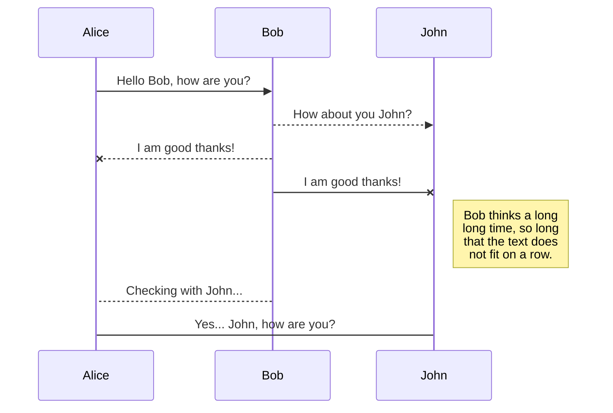
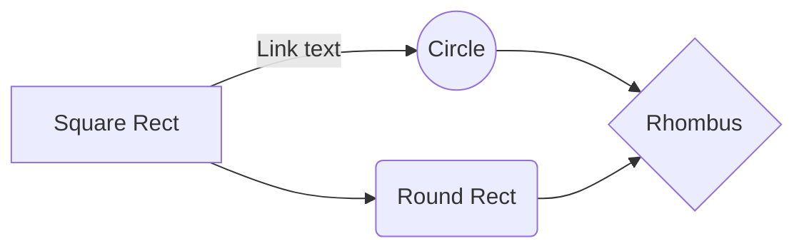

# O Projeto

NSDigital é um sistema para cadastro de Artistas, albuns e músicas.
Feito no Framework PHP Laravel, que dispoe de funcionalidades para Migrations, Migrations, Blade Template, Multi Tenancy, etc, além de contar com o gerenciador de dependências Composer. 
Foi utilizado o banco de dados relacional MySQL. Tudo isso em containers Docker.

## Container Docker - Passo a Passo

Primeiro, será necessário ter em sua máquina instalado o Docker, para que seja possível subir os containers e executar o sistema sem necessidade de instalar as tecnologias utilizadas na própria máquina. Para isso, segue um link mais detalhados com os passos para instalá-lo junto a suas dependências referentes a cada Sistema Operacional:

* [Instalando o Docker em qualquer Sistema Operacional](https://stack.desenvolvedor.expert/appendix/docker/instalacao.html)

**Step #1**

Há dois serviços, o laravel-app e o mysql-db, que serão levantados assim que você rodar o comando:

    > docker-compose build && docker-compose up -d

**Step #2**
Após isso, acesse através do docker o servidor apache (laravel-app) para que possamos utilizar o terminal, e executar alguns comandos necessários:
    
    > docker exec -it laravel-app bash
	
Agora já estamos dentro do servidor, e podemos usar as funcionalidades do framework, perceba que estamos na pasta /var/www/html, e aqui estão todos os arquivos do projeto que foram copiados e colados aqui através do Docker.

**Step #3**
Está na hora de executar o gerenciador de dependências para que nossas dependências de terceiros estejam prontas. 

    > compose update

**Step #4**
Gere a key da aplicação:
	
	> php artisan key:generate

**Step #5**
E agora, com esse comando, o Laravel cria as tabelas e alterações no banco de dados pré-estabelecidas pelas Migrations:

	> php artisan migrate

Pronto, a aplicação está pronta para ser acessada pelo seu navegador através do link:
	
 [http://127.0.0.1:8000/login](http://127.0.0.1:8000/login)

# O Sistema

	

## Referências

[https://stack.desenvolvedor.expert/appendix/docker/instalacao.html](https://stack.desenvolvedor.expert/appendix/docker/instalacao.html)

## Publish a File

You can publish your file by opening the **Publish** sub-menu and by clicking **Publish to**. For some locations, you can choose between the following formats:

- Markdown: publish the Markdown text on a website that can interpret it (**GitHub** for instance),
- HTML: publish the file converted to HTML via a Handlebars template (on a blog for example).

## SmartyPants

SmartyPants converts ASCII punctuation characters into "smart" typographic punctuation HTML entities. For example:

|                |ASCII                          |HTML                         |
|----------------|-------------------------------|-----------------------------|
|Single backticks|`'Isn't this fun?'`            |'Isn't this fun?'            |
|Quotes          |`"Isn't this fun?"`            |"Isn't this fun?"            |
|Dashes          |`-- is en-dash, --- is em-dash`|-- is en-dash, --- is em-dash|

## UML diagrams

You can render UML diagrams using [Mermaid](https://mermaidjs.github.io/). For example, this will produce a sequence diagram:

And this will produce a flow chart:

